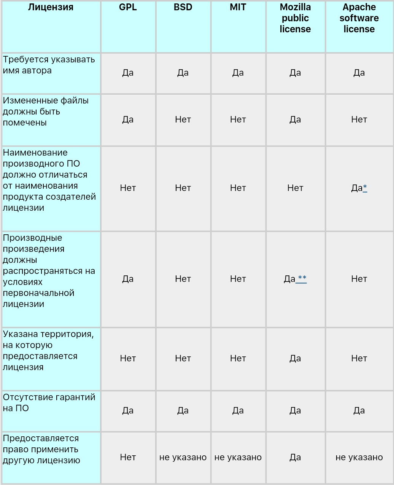

1. Различие между категориями "free software" и "Open source".

Все шесть лицензий, которые рассматриваются здесь, являются лицензиями, одобренными Open Source Initiative для распространения ПО с открытым исходным текстом. Эти же лицензии называются "лицензиями на свободное ПО" (free software licenses) на сайте проекта GNU Free software foundation (FSF). При этом совместимыми с лицензией GPL из указанных лицензий являются только три: LGPL, BSD и лицензия MIT. Лицензии Apache (версии 1.0 и 1.1), и Mozilla (версии 1.0 и 1.1) - лицензии на свободное ПО, несовместимые с GPL. В связи с этим хотелось бы кратко остановиться на различиях между концепциями "свободного ПО" (free software) и "ПО с открытыми исходными текстами".

Представители "Open Source Initiative", в частности г-н Давид Уилер (David A. Wheeler) употребляет эти термины, как синонимы, определяющие одно и то же понятие, однако указывает на их различное содержание. В своей статье он пишет: "Те, кто использует термин "ПО с открытыми исходными текстами" хотят подчеркнуть технические преимущества такого ПО (например, большую надежность и безопасность), тогда как те, кто использует термин "свободное ПО", хотят подчеркнуть независимость от контроля со стороны третьих лиц за использованием ПО".

Как считают представители FSF, в настоящее время Free Software и Open Source являются двумя самостоятельными движениями. "Мы не против движения Open Source, но мы не хотим, чтобы нас путали с этим движением", - так так указано на сайте FSF. Представители FSF считают, что понятие "ПО с открытыми исходными текстами" более-менее соответствует понятию "свободного ПО", однако предпочитают использовать именно последнее определение и приводят для этого целый ряд аргументов:

определение "открытый исходный текст" является слишком узким;
некоторые компании, разработчики "обычного" ПО используют определение "открытый исходный текст" в своих целях и придают этому определению совсем другой смысл.
2. Названия и тексты лицензий.

Тексты лицензий на английском языке можно найти как на сайте Open Source Initiative, так и на сайте GNU. Очевидно, что текст GPL и LGPL, а также изменения к ним или новые версии этих лицензий, если они появятся, лучше всего брать с сайта GNU. Однако тексты остальных лицензий: MIT, BSD, Mozilla public license, Apache software license лучше всего взять с сайта Open Source. Если вы внимательно прочитаете список лицензий на сайте Open Source и сравните его со списком лицензий на сайте GNU, то убедитесь, что отдельные лицензии на сайте GNU называются иначе. В частности, лицензия MIT на сайте GNU называется Expat license. Текст этой лицензии почти полностью соответствует тексту лицензии BSD, за исключением одного условия. В русских компьютерных изданиях упоминается также лицензия X-консорциума, или X11 (так она называется на сайте GNU). Этой лицензии нет в списке лицензий на сайте Open Source, может быть потому, что она практически повторяет лицензию MIT.

Отдельно следует остановиться на тексте лицензии BSD. Как известно, существует два варианта ее текста: с оговоркой о рекламе и без этой оговорки. Лицензия, которая одобрена для применения как Open Source, так и FSF - это лицензия без оговорки о рекламе. Эта оговорка была официально отменена директором Департамента Технологического Лицензирования Калифорнийского университета 22 июля 1999г. Текст лицензии BSD лучше брать с сайта Open Source.

В 2001г. появился еще один вариант лицензии BSD - это лицензия корпорации Intel "BSD+Patent License". Она специально разработана для того, чтобы позволить модифицировать и распространять ПО, которое может защищаться патентами на программное обеспечение корпорации Intel.

3. Совместимость с GPL.

Как уже было сказано выше, совместимыми с GPL из остальных пяти указанных лицензий, являются только три: LGPL, BSD, MIT. Совместимость с GPL означает, что разработчик вправе объединить модуль, который распространяется на условиях совместимой с GPL лицензии с модулем, распространяемым на условиях GPL, чтобы получить одну программу. Дальнейшее распространение полученной программы должно осуществляться в соответствии с условиями GPL (так называемый "Copyleft virus").

4. Сравнительная характеристика лицензий.

Для наглядности сравнительную характеристику условий лицензий лучше всего представить в виде таблицы, где будет указано о наличии или отсутствии в лицензии тех или иных требований.

Отдельно следует сказать о лицензии LGPL. Эта лицензия носит ограниченное применение:

она может применяться только к библиотеке;
произведение, производное от первоначальной библиотеки, также должно быть библиотекой.
Если создатель библиотеки решит заменить лицензию LGPL на GPL, то такая замена будет окончательной и повлечет за собой применение GPL ко всем последующим копиям данного экземпляра библиотеки и произведениям, производным от нее. LGPL содержит ряд специфических условий, в частности в отношении произведений, возникающих в результате связывания ПО, использующего библиотеку, с библиотекой. Такие произведения могут распространяться на любых условиях с соблюдением определенных требований LGPL.
